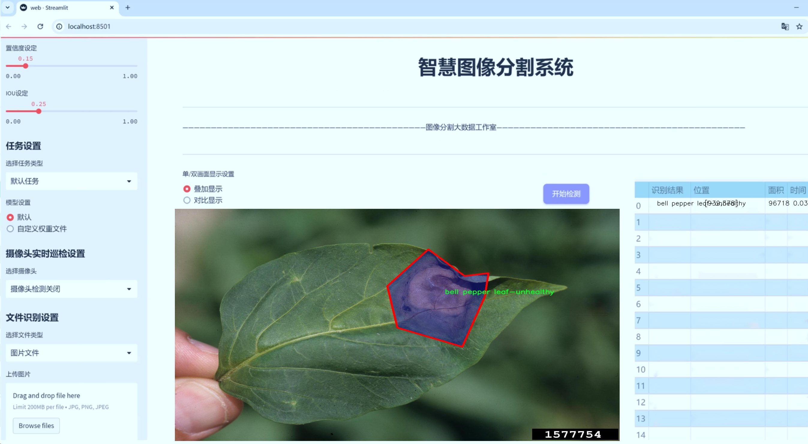
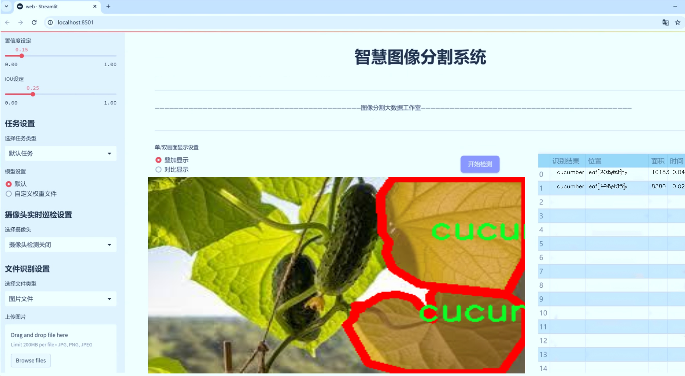
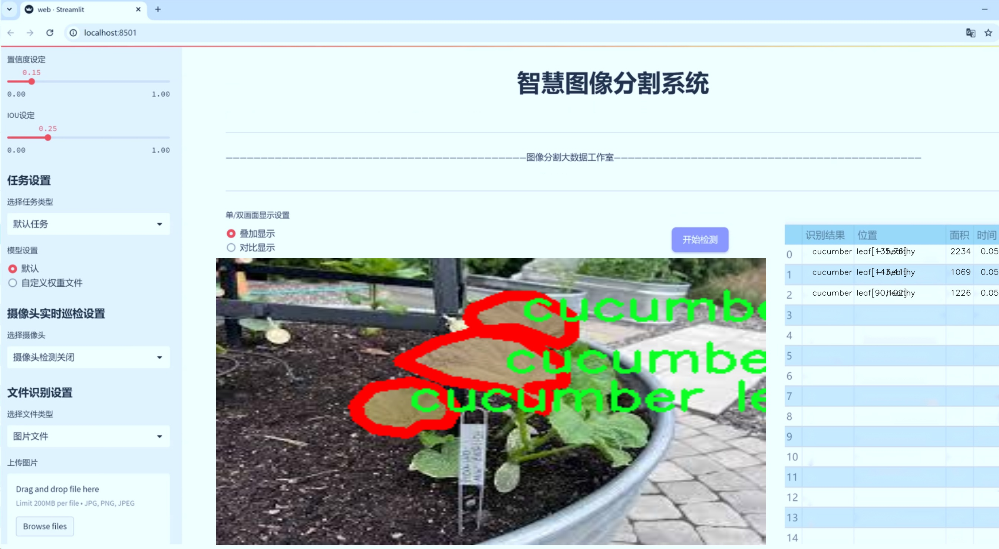
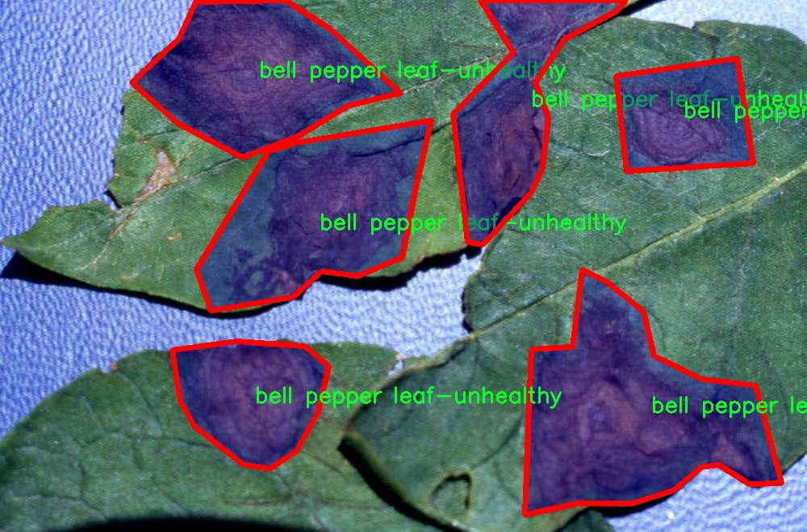
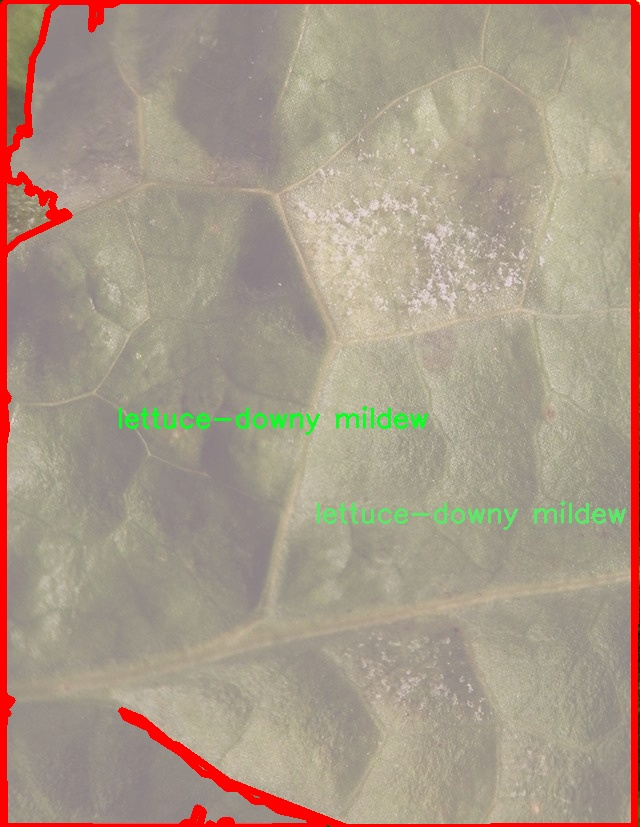
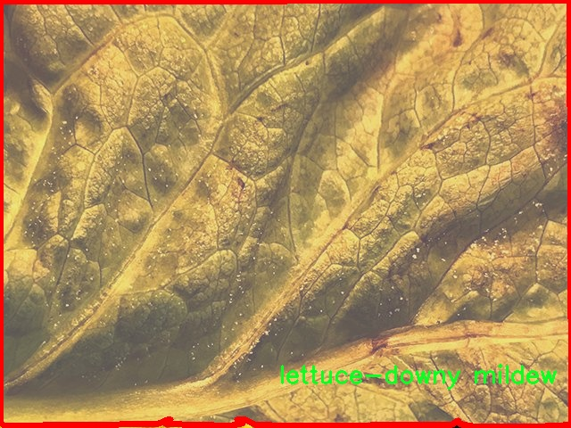
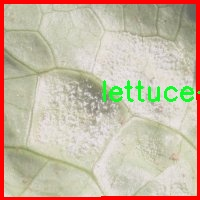
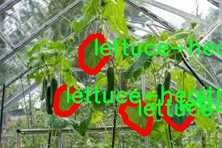

# 农作物病害图像分割系统源码＆数据集分享
 [yolov8-seg-SPDConv＆yolov8-seg-C2f-RFCAConv等50+全套改进创新点发刊_一键训练教程_Web前端展示]

### 1.研究背景与意义

项目参考[ILSVRC ImageNet Large Scale Visual Recognition Challenge](https://gitee.com/YOLOv8_YOLOv11_Segmentation_Studio/projects)

项目来源[AAAI Global Al lnnovation Contest](https://kdocs.cn/l/cszuIiCKVNis)

研究背景与意义

随着全球人口的不断增长，农业生产面临着巨大的挑战，尤其是在病害管理方面。农作物病害不仅影响作物的生长和产量，还可能对农民的经济收入造成严重影响。因此，及时、准确地识别和处理农作物病害，成为了现代农业发展的重要课题。近年来，深度学习技术的迅猛发展为农作物病害的识别与管理提供了新的解决方案。其中，YOLO（You Only Look Once）系列模型因其高效的实时目标检测能力而受到广泛关注。YOLOv8作为该系列的最新版本，具备了更强的特征提取能力和更快的推理速度，适合在复杂的农业环境中应用。

本研究旨在基于改进的YOLOv8模型，构建一个高效的农作物病害图像分割系统。该系统将利用一个包含1000张图像的数据集，涵盖29种不同类别的农作物病害。这些类别包括健康和不健康的甜椒、黄瓜、生菜、草莓和番茄等，能够有效地反映出不同作物在遭受病害时的表现。这一数据集的多样性和丰富性为模型的训练提供了良好的基础，使其能够在实际应用中更好地适应不同的农作物病害识别需求。

在传统的农作物病害识别方法中，往往依赖于人工观察和经验判断，这不仅效率低下，而且容易受到主观因素的影响。通过引入基于深度学习的图像分割技术，可以显著提高病害识别的准确性和效率。YOLOv8模型的改进版本，结合了先进的图像处理技术，能够实现对农作物病害的精确分割，帮助农民及时发现病害并采取相应的防治措施。

此外，农作物病害的及时识别不仅对提高作物产量具有重要意义，也对保障食品安全、促进可持续农业发展起到了积极的推动作用。通过对病害的早期检测，可以有效减少农药的使用，降低环境污染，推动绿色农业的发展。因此，构建一个基于改进YOLOv8的农作物病害图像分割系统，不仅具有重要的学术价值，也具有广泛的应用前景。

综上所述，本研究通过改进YOLOv8模型，构建农作物病害图像分割系统，旨在为农业病害管理提供一种高效、准确的技术手段。这一研究不仅能够推动农业智能化的发展，也为实现农业可持续发展目标提供了有力支持。随着技术的不断进步和应用的深入，期待该系统能够在未来的农业生产中发挥更大的作用，助力农民增收、促进农业现代化。

### 2.图片演示







##### 注意：由于此博客编辑较早，上面“2.图片演示”和“3.视频演示”展示的系统图片或者视频可能为老版本，新版本在老版本的基础上升级如下：（实际效果以升级的新版本为准）

  （1）适配了YOLOV8的“目标检测”模型和“实例分割”模型，通过加载相应的权重（.pt）文件即可自适应加载模型。

  （2）支持“图片识别”、“视频识别”、“摄像头实时识别”三种识别模式。

  （3）支持“图片识别”、“视频识别”、“摄像头实时识别”三种识别结果保存导出，解决手动导出（容易卡顿出现爆内存）存在的问题，识别完自动保存结果并导出到tempDir中。

  （4）支持Web前端系统中的标题、背景图等自定义修改，后面提供修改教程。

  另外本项目提供训练的数据集和训练教程,暂不提供权重文件（best.pt）,需要您按照教程进行训练后实现图片演示和Web前端界面演示的效果。

### 3.视频演示

[3.1 视频演示](https://www.bilibili.com/video/BV1V1SLYwEDH/)

### 4.数据集信息展示

##### 4.1 本项目数据集详细数据（类别数＆类别名）

nc: 20
names: ['bell pepper leaf-healthy', 'bell pepper leaf-unhealthy', 'cucumber leaf - healthy', 'cucumber leaf - unhealthy', 'cucumber veggie - healthy', 'cucumber veggie - unhealthy', 'cucumber-mosaic', 'cucumber-powdery-mildew', 'lettuce-bacterial leaf spot', 'lettuce-downy mildew', 'lettuce-healthy', 'lettuce-mosaic-virus', 'lettuce-powdery mildew', 'lettuce-septoria', 'lettuce-wilt and leaf blight', 'strawberry fruit-healthy', 'strawberry leaf-healthy', 'strawberry-angular-leafspot', 'tomato-early blight', 'tomato-healthy']


##### 4.2 本项目数据集信息介绍

数据集信息展示

在农业领域，作物病害的早期识别与处理对于保障农作物的健康生长和提高产量至关重要。为此，本研究采用了名为“Crop Disease Identification”的数据集，以训练和改进YOLOv8-seg模型，旨在实现高效的农作物病害图像分割系统。该数据集包含20个不同的类别，涵盖了多种常见农作物的健康与病害状态，能够为模型提供丰富的训练样本，从而提升其在实际应用中的准确性和鲁棒性。

具体而言，数据集中包括了多种不同类型的作物及其病害表现。例如，甜椒的叶片健康与不健康状态被清晰地标注，便于模型学习如何区分健康的植物组织与受到病害侵袭的部分。黄瓜作为另一种重要的农作物，其叶片和果实的健康与病害状态同样被详细记录，尤其是黄瓜花叶病和白粉病等特定病害的表现，为模型提供了丰富的学习素材。此外，生菜的多种病害，如细菌性叶斑病、霜霉病以及多种病毒感染，也在数据集中得到了充分体现。这些多样化的病害信息不仅增加了数据集的复杂性，也为模型的学习提供了多维度的挑战。

此外，草莓和番茄作为广泛种植的作物，其健康与病害状态同样被纳入数据集。草莓的健康叶片与角斑病的表现，以及番茄早期枯萎病的特征，都为模型的训练提供了必要的参考。这些类别的细致划分使得模型能够在识别过程中更加精准，能够有效地区分不同作物的健康状态与病害类型，从而实现更为精确的图像分割。

在数据集的构建过程中，确保了每个类别的样本数量和质量，以保证模型训练的有效性。通过多样化的图像采集和标注，数据集不仅涵盖了不同生长阶段的作物图像，还考虑了不同环境条件下的表现。这种全面性使得模型在面对真实世界中的复杂情况时，能够展现出更强的适应能力和识别准确性。

综上所述，“Crop Disease Identification”数据集为改进YOLOv8-seg的农作物病害图像分割系统提供了坚实的基础。通过对20个类别的详细标注和丰富样本的提供，该数据集不仅能够帮助模型学习到不同作物的病害特征，还能提升其在实际应用中的表现。随着农业科技的不断进步，借助于这一数据集所训练出的模型，将为农作物的健康管理和病害防治提供更为精准和高效的解决方案，助力现代农业的可持续发展。











### 5.全套项目环境部署视频教程（零基础手把手教学）

[5.1 环境部署教程链接（零基础手把手教学）](https://www.bilibili.com/video/BV1jG4Ve4E9t/?vd_source=bc9aec86d164b67a7004b996143742dc)


[5.2 安装Python虚拟环境创建和依赖库安装视频教程链接（零基础手把手教学）](https://www.bilibili.com/video/BV1nA4VeYEze/?vd_source=bc9aec86d164b67a7004b996143742dc)

### 6.手把手YOLOV8-seg训练视频教程（零基础小白有手就能学会）

[6.1 手把手YOLOV8-seg训练视频教程（零基础小白有手就能学会）](https://www.bilibili.com/video/BV1cA4VeYETe/?vd_source=bc9aec86d164b67a7004b996143742dc)


按照上面的训练视频教程链接加载项目提供的数据集，运行train.py即可开始训练



     Epoch   gpu_mem       box       obj       cls    labels  img_size
     1/200     0G   0.01576   0.01955  0.007536        22      1280: 100%|██████████| 849/849 [14:42<00:00,  1.04s/it]
               Class     Images     Labels          P          R     mAP@.5 mAP@.5:.95: 100%|██████████| 213/213 [01:14<00:00,  2.87it/s]
                 all       3395      17314      0.994      0.957      0.0957      0.0843

     Epoch   gpu_mem       box       obj       cls    labels  img_size
     2/200     0G   0.01578   0.01923  0.007006        22      1280: 100%|██████████| 849/849 [14:44<00:00,  1.04s/it]
               Class     Images     Labels          P          R     mAP@.5 mAP@.5:.95: 100%|██████████| 213/213 [01:12<00:00,  2.95it/s]
                 all       3395      17314      0.996      0.956      0.0957      0.0845

     Epoch   gpu_mem       box       obj       cls    labels  img_size
     3/200     0G   0.01561    0.0191  0.006895        27      1280: 100%|██████████| 849/849 [10:56<00:00,  1.29it/s]
               Class     Images     Labels          P          R     mAP@.5 mAP@.5:.95: 100%|███████   | 187/213 [00:52<00:00,  4.04it/s]
                 all       3395      17314      0.996      0.957      0.0957      0.0845


### 7.50+种全套YOLOV8-seg创新点代码加载调参视频教程（一键加载写好的改进模型的配置文件）

[7.1 50+种全套YOLOV8-seg创新点代码加载调参视频教程（一键加载写好的改进模型的配置文件）](https://www.bilibili.com/video/BV1Hw4VePEXv/?vd_source=bc9aec86d164b67a7004b996143742dc)

### 8.YOLOV8-seg图像分割算法原理

原始YOLOv8-seg算法原理

YOLOv8-seg算法是YOLO系列模型的最新版本，它在目标检测的基础上，进一步扩展了实例分割的能力。作为一种先进的计算机视觉技术，YOLOv8-seg不仅具备了快速而高效的目标检测能力，还能够对图像中的目标进行精确的像素级分割，从而实现更为细致的图像理解。YOLOv8-seg的设计理念和实现方法，体现了深度学习领域的最新研究成果，尤其是在卷积神经网络（CNN）架构的优化、特征提取与融合、以及损失函数的改进等方面。

YOLOv8-seg的核心结构依然遵循YOLO系列的传统，即由Backbone、Neck和Head三部分组成。Backbone部分负责从输入图像中提取多层次的特征，通常采用深度卷积网络以增强特征提取的能力。YOLOv8在Backbone中引入了CSP（Cross Stage Partial）结构，这种结构通过分割和合并特征图，能够有效减少计算量，同时提升模型的表达能力。相较于之前的版本，YOLOv8的Backbone设计更加深度和宽度可调，用户可以根据具体应用需求灵活设置depth_factor和width_factor，以适应不同的硬件环境和任务复杂度。

在Neck部分，YOLOv8-seg采用了PAN-FPN（Path Aggregation Network - Feature Pyramid Network）结构，旨在通过特征融合提升不同尺度目标的检测性能。PAN-FPN通过将不同层次的特征图进行连接和融合，能够有效地捕捉到图像中目标的多尺度信息。这一设计使得YOLOv8-seg在处理小目标和大目标时，均能保持较高的检测精度和分割效果。

Head部分是YOLOv8-seg的关键所在，它采用了全新的Anchor-Free检测头，摒弃了传统的Anchor-Based方法。通过这种解耦设计，YOLOv8-seg能够独立处理目标的分类和回归任务，进一步提升了模型的灵活性和准确性。解耦头的引入，使得模型在处理复杂场景时，能够更好地应对目标重叠和密集分布的情况。此外，YOLOv8-seg还引入了新的损失函数，以优化分割任务的训练过程，确保模型在像素级别的精度。

在训练过程中，YOLOv8-seg利用多尺度训练策略，通过对不同分辨率的图像进行训练，增强了模型的泛化能力。这种方法使得模型能够在不同场景和条件下，保持较高的检测和分割性能。同时，YOLOv8-seg还支持数据增强技术，通过随机裁剪、旋转、翻转等方式，进一步丰富训练数据，提高模型的鲁棒性。

YOLOv8-seg的应用场景非常广泛，涵盖了智能监控、自动驾驶、医学影像分析等多个领域。在智能监控中，YOLOv8-seg能够实时检测和分割出监控画面中的人、车、物等目标，为安全监控提供有力支持。在自动驾驶领域，YOLOv8-seg可以精确识别道路上的行人、车辆和交通标志，为自动驾驶系统提供重要的环境感知能力。此外，在医学影像分析中，YOLOv8-seg能够对CT、MRI等医学图像进行精确分割，辅助医生进行疾病诊断。

总的来说，YOLOv8-seg算法在YOLO系列的基础上，结合了最新的深度学习技术和优化策略，极大地提升了目标检测和实例分割的性能。其高效的推理速度和优越的精度，使得YOLOv8-seg成为当前计算机视觉领域中的一项重要工具。随着技术的不断进步，YOLOv8-seg有望在更多实际应用中发挥更大的作用，推动计算机视觉技术的进一步发展。


### 9.系统功能展示（检测对象为举例，实际内容以本项目数据集为准）

图9.1.系统支持检测结果表格显示

  图9.2.系统支持置信度和IOU阈值手动调节

  图9.3.系统支持自定义加载权重文件best.pt(需要你通过步骤5中训练获得)

  图9.4.系统支持摄像头实时识别

  图9.5.系统支持图片识别

  图9.6.系统支持视频识别

  图9.7.系统支持识别结果文件自动保存

  图9.8.系统支持Excel导出检测结果数据


### 10.50+种全套YOLOV8-seg创新点原理讲解（非科班也可以轻松写刊发刊，V11版本正在科研待更新）

#### 10.1 由于篇幅限制，每个创新点的具体原理讲解就不一一展开，具体见下列网址中的创新点对应子项目的技术原理博客网址【Blog】：


[10.1 50+种全套YOLOV8-seg创新点原理讲解链接](https://gitee.com/qunmasj/good)

#### 10.2 部分改进模块原理讲解(完整的改进原理见上图和技术博客链接)【如果此小节的图加载失败可以通过CSDN或者Github搜索该博客的标题访问原始博客，原始博客图片显示正常】

### YOLOv8模型
YOLOv8模型由Ultralytics团队在YOLOv5模型的基础上，吸收了近两年半来经过实际验证的各种改进，于2023年1月提出。与之前的一些YOLO 系列模型想类似，YOLOv8模型也有多种尺寸，下面以YOLOv8n为例，分析 YOLOv8模型的结构和改进点。YOLOv8模型网络结构如
输入图片的部分，由于发现Mosaic数据增强尽管这有助于提升模型的鲁棒性和泛化性，但是，在一定程度上，也会破坏数据的真实分布，使得模型学习到一些不好的信息。所以YOLOv8模型在训练中的最后10个epoch 停止使用Mosaic数据增强。


在网络结构上，首先主干网络的改变不大，主要是将C3模块替换为了C2f模块，该模块的结构在上图中已示出。C2f模块在C3模块的思路基础上，引入了YOLOv7中 ELAN的思路，引入了更多的跳层连接，这有助于该模块获得更丰富的梯度流信息，而且模型的轻量化得到了保证。依然保留了SPPF，效果不变的同时减少了该模块的执行时间。
在颈部网络中，也是将所有的C3模块更改为C2f模块，同时删除了两处上采样之前的卷积连接层。
在头部网络中，采用了YOLOX中使用的解耦头的思路，两条并行的分支分别提取类别和位置特征。由于分类任务更注重于分析特征图中提取到的特征与已输入图片的部分，由于发现 Mosaic数据增强尽管这有助于提升模型的鲁棒性和泛化性，但是，在一定程度上，也会破坏数据的真实分布，使得模型学习到一些不好的信息。所以YOLOv8模型在训练中的最后10个epoch停止使用Mosaic数据增强。
在网络结构上，首先主干网络的改变不大，主要是将C3模块替换为了C2f模块，该模块的结构在上图中已示出。C2f模块在C3模块的思路基础上，引入了YOLOv7中ELAN的思路，引入了更多的跳层连接，这有助于该模块获得更丰富的梯度流信息，而且模型的轻量化得到了保证。依然保留了SPPF，效果不变的同时减少了该模块的执行时间。
在颈部网络中，也是将所有的C3模块更改为C2f模块，同时删除了两处上采样之前的卷积连接层。
在头部网络中，采用了YOLOX中使用的解耦头的思路，两条并行的分支分别提取类别和位置特征。由于分类任务更注重于分析特征图中提取到的特征与已有类别中的哪一种更为相似，而定位任务更关注边界框与真值框的位置关系，并据此对边界框的坐标进行调整。侧重点的不同使得在使用两个检测头时收敛的速度和预测的精度有所提高。而且使用了无锚框结构，直接预测目标的中心，并使用TAL (Task Alignment Learning，任务对齐学习）来区分正负样本，引入了分类分数和IOU的高次幂乘积作为衡量任务对齐程度的指标，认为同时拥有好的定位和分类评价的在分类和定位损失函数中也引入了这项指标。
在模型的检测结果上，YOLOv8模型也取得了较好的成果，图为官方在coCO数据集上 YOLOv8模型的模型尺寸大小和检测的mAP50-95对比图。mAP50-95指的是IOU的值从50%取到95%，步长为5%，然后算在这些IOU下的mAP的均值。图的 a）图展示了YOLOv8在同尺寸下模型中参数没有较大增加的前提下取得了比其他模型更好的精度，图2-17的b)图展示了YOLOv8比其他YOLO系列模型在同尺寸时，推理速度更快且精度没有太大下降。


### 视觉transformer(ViT)简介
视觉transformer(ViT)最近在各种计算机视觉任务中证明了巨大的成功，并受到了相当多的关注。与卷积神经网络(CNNs)相比，ViT具有更强的全局信息捕获能力和远程交互能力，表现出优于CNNs的准确性，特别是在扩大训练数据大小和模型大小时[An image is worth 16x16 words: Transformers for image recognition at scale,Coatnet]。

尽管ViT在低分辨率和高计算领域取得了巨大成功，但在高分辨率和低计算场景下，ViT仍不如cnn。例如，下图(左)比较了COCO数据集上当前基于cnn和基于vit的一级检测器。基于vit的检测器(160G mac)和基于cnn的检测器(6G mac)之间的效率差距超过一个数量级。这阻碍了在边缘设备的实时高分辨率视觉应用程序上部署ViT。


左图:现有的基于vit的一级检测器在实时目标检测方面仍然不如当前基于cnn的一级检测器，需要的计算量多出一个数量级。本文引入了第一个基于vit的实时对象检测器来弥补这一差距。在COCO上，efficientvit的AP比efficientdet高3.8，而mac较低。与YoloX相比，efficient ViT节省67.2%的计算成本，同时提供更高的AP。

中:随着输入分辨率的增加，计算成本呈二次增长，无法有效处理高分辨率的视觉应用。

右图:高分辨率对图像分割很重要。当输入分辨率从1024x2048降低到512x1024时，MobileNetV2的mIoU减少12% (8.5 mIoU)。在不提高分辨率的情况下，只提高模型尺寸是无法缩小性能差距的。

ViT的根本计算瓶颈是softmax注意模块，其计算成本随输入分辨率的增加呈二次增长。例如，如上图(中)所示，随着输入分辨率的增加，vit- small[Pytorch image models. https://github.com/rwightman/ pytorch-image-models]的计算成本迅速显著大于ResNet-152的计算成本。

解决这个问题的一个直接方法是降低输入分辨率。然而，高分辨率的视觉识别在许多现实世界的计算机视觉应用中是必不可少的，如自动驾驶，医疗图像处理等。当输入分辨率降低时，图像中的小物体和精细细节会消失，导致目标检测和语义分割性能显著下降。

上图(右)显示了在cityscape数据集上不同输入分辨率和宽度乘法器下MobileNetV2的性能。例如，将输入分辨率从1024x2048降低到512x1024会使cityscape的性能降低12% (8.5 mIoU)。即使是3.6倍高的mac，只放大模型尺寸而不增加分辨率也无法弥补这一性能损失。

除了降低分辨率外，另一种代表性的方法是限制softmax注意，方法是将其范围限制在固定大小的局部窗口内[Swin transformer,Swin transformer v2]或降低键/值张量的维数[Pyramid vision transformer,Segformer]。然而，它损害了ViT的非局部注意能力，降低了全局接受域(ViT最重要的优点)，使得ViT与大内核cnn的区别更小[A convnet for the 2020s,Scaling up your kernels to 31x31: Revisiting large kernel design in cnns,Lite pose: Efficient architecture design for 2d human pose estimation]。

本文介绍了一个有效的ViT体系结构，以解决这些挑战。发现没有必要坚持softmax注意力。本文建议用线性注意[Transformers are rnns: Fast autoregressive transformers with linear attention]代替softmax注意。

线性注意的关键好处是，它保持了完整的n 2 n^2n 2
 注意映射，就像softmax注意。同时，它利用矩阵乘法的联想特性，避免显式计算完整的注意映射，同时保持相同的功能。因此，它保持了softmax注意力的全局特征提取能力，且计算复杂度仅为线性。线性注意的另一个关键优点是它避免了softmax，这使得它在移动设备上更有效(下图左)。


左图:线性注意比类似mac下的softmax注意快3.3-4.5倍，这是因为去掉了硬件效率不高的softmax功能。延迟是在Qualcomm Snapdragon 855 CPU和TensorFlow-Lite上测量的。本文增加线性注意的头部数量，以确保它具有与softmax注意相似的mac。

中:然而，如果没有softmax注意中使用的非线性注意评分归一化，线性注意无法有效集中其注意分布，削弱了其局部特征提取能力。后文提供了可视化。

右图:本文用深度卷积增强线性注意，以解决线性注意的局限性。深度卷积可以有效地捕捉局部特征，而线性注意可以专注于捕捉全局信息。增强的线性注意在保持线性注意的效率和简单性的同时，表现出在各种视觉任务上的强大表现(图4)。

然而，直接应用线性注意也有缺点。以往的研究表明线性注意和softmax注意之间存在显著的性能差距(下图中间)。


左:高通骁龙855上的精度和延迟权衡。效率vit比效率网快3倍，精度更高。中:ImageNet上softmax注意与线性注意的比较。在相同的计算条件下，本文观察到softmax注意与线性注意之间存在显著的精度差距。而深度卷积增强模型后，线性注意的精度有明显提高。

相比之下，softmax注意的精度变化不大。在相同MAC约束下，增强线性注意比增强软最大注意提高了0.3%的精度。右图:与增强的softmax注意相比，增强的线性注意硬件效率更高，随着分辨率的增加，延迟增长更慢。

深入研究线性注意和softmax注意的详细公式，一个关键的区别是线性注意缺乏非线性注意评分归一化方案。这使得线性注意无法有效地将注意力分布集中在局部模式产生的高注意分数上，从而削弱了其局部特征提取能力。

本文认为这是线性注意的主要限制，使其性能不如softmax注意。本文提出了一个简单而有效的解决方案来解决这一限制，同时保持线性注意在低复杂度和低硬件延迟方面的优势。具体来说，本文建议通过在每个FFN层中插入额外的深度卷积来增强线性注意。因此，本文不需要依赖线性注意进行局部特征提取，避免了线性注意在捕捉局部特征方面的不足，并利用了线性注意在捕捉全局特征方面的优势。

本文广泛评估了efficient vit在低计算预算下对各种视觉任务的有效性，包括COCO对象检测、城市景观语义分割和ImageNet分类。本文想要突出高效的主干设计，所以没有包括任何正交的附加技术(例如，知识蒸馏，神经架构搜索)。尽管如此，在COCO val2017上，efficientvit的AP比efficientdet - d1高2.4倍，同时节省27.9%的计算成本。在cityscape上，efficientvit提供了比SegFormer高2.5个mIoU，同时降低了69.6%的计算成本。在ImageNet上，efficientvit在584M mac上实现了79.7%的top1精度，优于efficientnet - b1的精度，同时节省了16.6%的计算成本。

与现有的以减少参数大小或mac为目标的移动ViT模型[Mobile-former,Mobilevit,NASVit]不同，本文的目标是减少移动设备上的延迟。本文的模型不涉及复杂的依赖或硬件低效操作。因此，本文减少的计算成本可以很容易地转化为移动设备上的延迟减少。

在高通骁龙855 CPU上，efficient vit运行速度比efficientnet快3倍，同时提供更高的ImageNet精度。本文的代码和预训练的模型将在出版后向公众发布。

### Efficient Vision Transformer.
提高ViT的效率对于在资源受限的边缘平台上部署ViT至关重要，如手机、物联网设备等。尽管ViT在高计算区域提供了令人印象深刻的性能，但在针对低计算区域时，它通常不如以前高效的cnn[Efficientnet, mobilenetv3,Once for all: Train one network and specialize it for efficient deployment]。为了缩小差距，MobileViT建议结合CNN和ViT的长处，使用transformer将卷积中的局部处理替换为全局处理。MobileFormer提出了在MobileNet和Transformer之间建立双向桥以实现特征融合的并行化。NASViT提出利用神经架构搜索来搜索高效的ViT架构。

这些模型在ImageNet上提供了极具竞争力的准确性和效率的权衡。然而，它们并不适合高分辨率的视觉任务，因为它们仍然依赖于softmax注意力。


在本节中，本文首先回顾了自然语言处理中的线性注意，并讨论了它的优缺点。接下来，本文介绍了一个简单而有效的解决方案来克服线性注意的局限性。最后，给出了efficient vit的详细架构。

 为可学习投影矩阵。Oi表示矩阵O的第i行。Sim(·，·)为相似度函数。

虽然softmax注意力在视觉和NLP方面非常成功，但它并不是唯一的选择。例如，线性注意提出了如下相似度函数:


其中，φ(·)为核函数。在本工作中，本文选择了ReLU作为内核函数，因为它对硬件来说是友好的。当Sim(Q, K) = φ(Q)φ(K)T时，式(1)可改写为:


线性注意的一个关键优点是，它允许利用矩阵乘法的结合律，在不改变功能的情况下，将计算复杂度从二次型降低到线性型:


除了线性复杂度之外，线性注意的另一个关键优点是它不涉及注意模块中的softmax。Softmax在硬件上效率非常低。避免它可以显著减少延迟。例如，下图(左)显示了softmax注意和线性注意之间的延迟比较。在类似的mac上，线性注意力比移动设备上的softmax注意力要快得多。


#### EfficientViT
Enhancing Linear Attention with Depthwise Convolution

虽然线性注意在计算复杂度和硬件延迟方面优于softmax注意，但线性注意也有局限性。以往的研究[\[Luna: Linear unified nested attention,Random feature attention,Combiner: Full attention transformer with sparse computation cost,cosformer: Rethinking softmax in attention\]](https://afdian.net/item/602b9612927111ee9ec55254001e7c00)表明，在NLP中线性注意和softmax注意之间通常存在显著的性能差距。对于视觉任务，之前的研究[Visual correspondence hallucination,Quadtree attention for vision transformers]也表明线性注意不如softmax注意。在本文的实验中，本文也有类似的观察结果(图中)。


本文对这一假设提出了质疑，认为线性注意的低劣性能主要是由于局部特征提取能力的丧失。如果没有在softmax注意中使用的非线性评分归一化，线性注意很难像softmax注意那样集中其注意分布。下图(中间)提供了这种差异的示例。


在相同的原始注意力得分下，使用softmax比不使用softmax更能集中注意力。因此，线性注意不能有效地聚焦于局部模式产生的高注意分数(下图)，削弱了其局部特征提取能力。


注意图的可视化显示了线性注意的局限性。通过非线性注意归一化，softmax注意可以产生清晰的注意分布，如中间行所示。相比之下，线性注意的分布相对平滑，使得线性注意在捕捉局部细节方面的能力较弱，造成了显著的精度损失。本文通过深度卷积增强线性注意来解决这一限制，并有效提高了准确性。

介绍了一个简单而有效的解决方案来解决这个限制。本文的想法是用卷积增强线性注意，这在局部特征提取中是非常有效的。这样，本文就不需要依赖于线性注意来捕捉局部特征，而可以专注于全局特征提取。具体来说，为了保持线性注意的效率和简单性，本文建议在每个FFN层中插入一个深度卷积，这样计算开销很小，同时极大地提高了线性注意的局部特征提取能力。

#### Building Block

下图(右)展示了增强线性注意的详细架构，它包括一个线性注意层和一个FFN层，在FFN的中间插入深度卷积。


与之前的方法[Swin transformer,Coatnet]不同，本文在efficientvit中没有使用相对位置偏差。相对位置偏差虽然可以改善模型的性能，但它使模型容易受到分辨率变化[Segformer]的影响。多分辨率训练或新分辨率下的测试在检测和分割中很常见。去除相对位置偏差使高效率vit对输入分辨率更加灵活。

与之前低计算CNNs[Mobilenetv2,mobilenetv3]的设计不同，本文为下采样块添加了额外的下采样快捷方式。每个下采样快捷方式由一个平均池和一个1x1卷积组成。在本文的实验中，这些额外的下采样快捷方式可以稳定训练效率，提高性能。

#### Macro Architecture

下图说明了efficientvit的宏观体系结构。它由输入 stem 和4级组成。最近的研究[Coatnet,Levit,Early convolutions help transformers see better]表明在早期阶段使用卷积对ViT更好。本文遵循这个设计，在第三阶段开始使用增强的线性注意。


EfficientViT宏观架构。本文从第三阶段开始使用增强的线性注意。P2、P3和P4形成了一个金字塔特征图，用于检测和分割。P4用于分类。

为了突出高效的主干本身，本文对MBConv和FFN使用相同的扩展比e (e = 4)保持超参数简单，对所有深度卷积使用相同的内核大小k(除了输入stem)，对所有层使用相同的激活函数(hard swish)。

P2、P3和P4表示阶段2、3和4的输出，形成了特征图的金字塔。本文按照惯例将P2、P3和P4送至检测头。本文使用Yolov8进行检测。为了分割，本文融合了P2和P4。融合特征被馈送到一个轻量级头，包括几个卷积层，遵循Fast-SCNN。为了分类，本文将P4输入到轻量级头部，与MobileNetV3相同。


### 11.项目核心源码讲解（再也不用担心看不懂代码逻辑）

#### 11.1 ultralytics\models\yolo\detect\__init__.py

以下是对给定代码的核心部分进行分析和详细注释的结果：

```python
# Ultralytics YOLO 🚀, AGPL-3.0 license

# 从当前包中导入检测预测器、检测训练器和检测验证器类
from .predict import DetectionPredictor  # 导入用于目标检测的预测类
from .train import DetectionTrainer      # 导入用于训练模型的训练类
from .val import DetectionValidator       # 导入用于验证模型性能的验证类

# 定义当前模块的公开接口，指定可以被外部访问的类
__all__ = 'DetectionPredictor', 'DetectionTrainer', 'DetectionValidator'
```

### 代码分析与注释

1. **模块导入**：
   - `from .predict import DetectionPredictor`：从当前包的 `predict` 模块中导入 `DetectionPredictor` 类，该类通常用于进行目标检测的预测。
   - `from .train import DetectionTrainer`：从当前包的 `train` 模块中导入 `DetectionTrainer` 类，该类用于训练目标检测模型。
   - `from .val import DetectionValidator`：从当前包的 `val` 模块中导入 `DetectionValidator` 类，该类用于验证目标检测模型的性能。

2. **公开接口定义**：
   - `__all__` 是一个特殊变量，用于定义当前模块中可以被外部导入的名称。这里将 `DetectionPredictor`、`DetectionTrainer` 和 `DetectionValidator` 三个类列入其中，意味着当用户使用 `from module_name import *` 时，这三个类将被导入。

### 核心功能
- 该代码片段主要用于组织和管理目标检测相关的功能模块，包括预测、训练和验证。通过这种方式，用户可以方便地使用这些功能，而不需要了解模块内部的实现细节。

这个文件是Ultralytics YOLO项目中的一个初始化文件，通常用于定义模块的公共接口。在这个文件中，首先通过注释说明了该项目的名称“Ultralytics YOLO”以及其使用的许可证类型（AGPL-3.0）。接下来，文件从同一目录下导入了三个类：`DetectionPredictor`、`DetectionTrainer`和`DetectionValidator`。这些类分别用于目标检测的不同阶段：预测、训练和验证。

最后，`__all__`变量被定义为一个元组，包含了三个类的名称。这意味着当使用`from ultralytics.models.yolo.detect import *`这种方式导入时，只会导入`DetectionPredictor`、`DetectionTrainer`和`DetectionValidator`这三个类。这种做法有助于控制模块的公共接口，避免不必要的命名冲突或暴露内部实现细节。

总体来说，这个文件的主要作用是组织和管理YOLO模型相关的功能模块，使得用户可以方便地进行目标检测的训练、验证和预测。

#### 11.2 ultralytics\utils\callbacks\neptune.py

以下是代码中最核心的部分，并附上详细的中文注释：

```python
# 导入必要的库
from ultralytics.utils import LOGGER, SETTINGS, TESTS_RUNNING

# 尝试导入neptune库并进行一些基本的检查
try:
    assert not TESTS_RUNNING  # 确保不在pytest测试中
    assert SETTINGS['neptune'] is True  # 确保neptune集成已启用
    import neptune
    from neptune.types import File

    assert hasattr(neptune, '__version__')  # 确保neptune库有版本属性

    run = None  # 初始化NeptuneAI实验记录实例

except (ImportError, AssertionError):
    neptune = None  # 如果导入失败，则将neptune设置为None


def _log_scalars(scalars, step=0):
    """将标量数据记录到NeptuneAI实验记录器中。"""
    if run:  # 如果NeptuneAI运行实例存在
        for k, v in scalars.items():  # 遍历标量字典
            run[k].append(value=v, step=step)  # 记录标量值和步骤


def _log_images(imgs_dict, group=''):
    """将图像记录到NeptuneAI实验记录器中。"""
    if run:  # 如果NeptuneAI运行实例存在
        for k, v in imgs_dict.items():  # 遍历图像字典
            run[f'{group}/{k}'].upload(File(v))  # 上传图像文件


def on_pretrain_routine_start(trainer):
    """在训练例程开始之前调用的回调函数。"""
    try:
        global run
        # 初始化Neptune运行实例，设置项目和名称
        run = neptune.init_run(project=trainer.args.project or 'YOLOv8', name=trainer.args.name, tags=['YOLOv8'])
        # 记录超参数配置
        run['Configuration/Hyperparameters'] = {k: '' if v is None else v for k, v in vars(trainer.args).items()}
    except Exception as e:
        LOGGER.warning(f'WARNING ⚠️ NeptuneAI安装但未正确初始化，未记录此运行。 {e}')


def on_train_epoch_end(trainer):
    """每个训练周期结束时调用的回调函数。"""
    _log_scalars(trainer.label_loss_items(trainer.tloss, prefix='train'), trainer.epoch + 1)  # 记录训练损失
    _log_scalars(trainer.lr, trainer.epoch + 1)  # 记录学习率
    if trainer.epoch == 1:  # 如果是第一个周期
        # 记录训练批次的图像
        _log_images({f.stem: str(f) for f in trainer.save_dir.glob('train_batch*.jpg')}, 'Mosaic')


def on_val_end(validator):
    """每次验证结束时调用的回调函数。"""
    if run:
        # 记录验证集的图像
        _log_images({f.stem: str(f) for f in validator.save_dir.glob('val*.jpg')}, 'Validation')


def on_train_end(trainer):
    """训练结束时调用的回调函数。"""
    if run:
        # 记录最终结果，包括混淆矩阵和PR曲线
        files = [
            'results.png', 'confusion_matrix.png', 'confusion_matrix_normalized.png',
            *(f'{x}_curve.png' for x in ('F1', 'PR', 'P', 'R'))]
        files = [(trainer.save_dir / f) for f in files if (trainer.save_dir / f).exists()]  # 过滤存在的文件
        for f in files:
            _log_plot(title=f.stem, plot_path=f)  # 记录图表
        # 记录最终模型
        run[f'weights/{trainer.args.name or trainer.args.task}/{str(trainer.best.name)}'].upload(File(str(trainer.best)))


# 定义回调函数字典
callbacks = {
    'on_pretrain_routine_start': on_pretrain_routine_start,
    'on_train_epoch_end': on_train_epoch_end,
    'on_fit_epoch_end': on_fit_epoch_end,
    'on_val_end': on_val_end,
    'on_train_end': on_train_end} if neptune else {}
```

### 代码核心部分说明：
1. **NeptuneAI集成**：代码首先尝试导入`neptune`库并进行基本的设置检查，以确保集成能够正常工作。
2. **日志记录函数**：定义了多个函数用于记录标量、图像和图表，这些数据将被上传到NeptuneAI进行可视化和分析。
3. **回调函数**：定义了一系列回调函数，这些函数在训练的不同阶段被调用，以记录训练过程中的重要信息，如损失、学习率、验证结果等。
4. **异常处理**：在初始化NeptuneAI时，代码包含异常处理机制，以防止在未正确初始化时继续记录数据。

这个程序文件是一个用于与NeptuneAI集成的回调模块，主要用于在训练YOLO模型时记录和上传实验数据。文件首先导入了一些必要的模块和设置，包括日志记录器、设置参数和测试状态。接着，尝试导入Neptune库，并进行一些基本的检查，比如确认当前不是在测试环境中，并且Neptune集成已启用。如果导入失败或检查不通过，则将`neptune`设置为`None`。

文件中定义了一些私有函数，用于记录不同类型的数据到NeptuneAI实验日志中。`_log_scalars`函数用于记录标量数据，比如损失值和学习率；`_log_images`函数用于上传图像数据；`_log_plot`函数用于记录绘图数据，接收绘图标题和路径，并使用Matplotlib读取和上传图像。

接下来，定义了一些回调函数，这些函数在训练的不同阶段被调用。`on_pretrain_routine_start`函数在训练开始前被调用，初始化Neptune运行并记录超参数配置。`on_train_epoch_end`函数在每个训练周期结束时被调用，记录训练损失和学习率，并在第一轮结束时上传训练批次的图像。`on_fit_epoch_end`函数在每个训练和验证周期结束时被调用，记录模型的配置信息和训练指标。`on_val_end`函数在验证结束时被调用，上传验证图像。最后，`on_train_end`函数在训练结束时被调用，记录最终结果、混淆矩阵和其他性能曲线，并上传最佳模型的权重。

最后，程序将这些回调函数组织成一个字典，只有在成功导入Neptune时才会创建这个字典，以便在训练过程中根据需要调用相应的回调函数。整体上，这个模块的目的是方便用户在使用YOLO模型进行训练时，能够将训练过程中的重要数据实时记录到NeptuneAI中，便于后续的分析和可视化。

#### 11.3 ultralytics\utils\callbacks\dvc.py

以下是代码中最核心的部分，并附上详细的中文注释：

```python
# 导入必要的库
from ultralytics.utils import LOGGER, SETTINGS, TESTS_RUNNING, checks

try:
    # 确保没有在运行测试
    assert not TESTS_RUNNING  
    # 确保DVC集成已启用
    assert SETTINGS['dvc'] is True  
    import dvclive  # 导入DVC Live库
    # 检查DVC Live的版本
    assert checks.check_version('dvclive', '2.11.0', verbose=True)

    import os
    import re
    from pathlib import Path

    # 创建DVCLive日志实例
    live = None
    _processed_plots = {}  # 用于记录已处理的图表

    # 训练周期标志，区分最佳模型的最终评估与最后一个周期的验证
    _training_epoch = False

except (ImportError, AssertionError, TypeError):
    dvclive = None  # 如果导入失败，dvclive设为None


def _log_images(path, prefix=''):
    """记录指定路径的图像，使用可选的前缀，利用DVCLive进行日志记录。"""
    if live:  # 如果DVCLive实例存在
        name = path.name
        # 通过批次分组图像，以便在UI中启用滑块
        m = re.search(r'_batch(\d+)', name)
        if m:
            ni = m[1]
            new_stem = re.sub(r'_batch(\d+)', '_batch', path.stem)
            name = (Path(new_stem) / ni).with_suffix(path.suffix)

        live.log_image(os.path.join(prefix, name), path)  # 记录图像


def on_train_end(trainer):
    """在训练结束时，如果DVCLive活动，记录最佳指标、图表和混淆矩阵。"""
    if live:
        # 在结束时记录最佳指标，内部会在最佳模型上运行验证器
        all_metrics = {**trainer.label_loss_items(trainer.tloss, prefix='train'), **trainer.metrics, **trainer.lr}
        for metric, value in all_metrics.items():
            live.log_metric(metric, value, plot=False)  # 记录指标

        # 记录验证集的图表
        _log_plots(trainer.plots, 'val')
        _log_plots(trainer.validator.plots, 'val')
        _log_confusion_matrix(trainer.validator)  # 记录混淆矩阵

        if trainer.best.exists():  # 如果最佳模型存在
            live.log_artifact(trainer.best, copy=True, type='model')  # 记录模型

        live.end()  # 结束日志记录


# 定义回调函数字典
callbacks = {
    'on_train_end': on_train_end
} if dvclive else {}
```

### 代码核心部分说明：
1. **导入库和设置**：导入必要的库，并进行一些基本的设置和检查，确保DVC Live的集成和版本正确。
2. **日志记录函数**：`_log_images`函数用于记录图像，确保图像按照批次分组以便于在UI中展示。
3. **训练结束回调**：`on_train_end`函数在训练结束时被调用，记录训练过程中的最佳指标、图表和混淆矩阵，确保所有重要的训练信息都被记录下来。
4. **回调字典**：定义一个回调字典，用于存储训练过程中的各个阶段的回调函数。

这个程序文件 `ultralytics/utils/callbacks/dvc.py` 是用于集成 DVCLive 日志记录工具的，主要目的是在训练过程中记录和可视化模型的训练进度和性能指标。代码首先导入了一些必要的模块和库，包括日志记录器、设置和检查工具。接着，程序尝试验证当前是否在测试环境中运行，并检查 DVCLive 是否已启用。如果 DVCLive 未正确导入或未启用，相关功能将被禁用。

在文件中，定义了一些辅助函数来处理图像和图表的记录。`_log_images` 函数用于记录指定路径下的图像，并支持使用前缀来组织图像。`_log_plots` 函数则用于记录训练过程中的图表，如果图表未被处理过，则会记录这些图表。`_log_confusion_matrix` 函数用于记录混淆矩阵，这对于分类任务的性能评估非常重要。

接下来，文件定义了一系列回调函数，这些函数会在训练的不同阶段被调用。`on_pretrain_routine_start` 函数在预训练开始时初始化 DVCLive 日志记录器，并记录相关信息。`on_pretrain_routine_end` 函数在预训练结束时记录训练过程中的图表。`on_train_start` 函数在训练开始时记录训练参数。

`on_train_epoch_start` 函数在每个训练周期开始时设置一个全局变量，表示当前正在进行训练周期。`on_fit_epoch_end` 函数在每个训练周期结束时记录训练指标和模型信息，并调用 `_log_plots` 函数记录训练和验证的图表。`on_train_end` 函数在训练结束时记录最佳指标、图表和混淆矩阵，并结束 DVCLive 的记录。

最后，代码定义了一个回调字典 `callbacks`，其中包含了所有在 DVCLive 启用时需要调用的回调函数。如果 DVCLive 未启用，则该字典将为空。这个文件的整体目的是通过 DVCLive 提供的功能来增强模型训练过程中的可视化和记录能力，帮助用户更好地理解和分析模型的性能。

#### 11.4 ultralytics\utils\files.py

以下是代码中最核心的部分，并附上详细的中文注释：

```python
import os
from pathlib import Path
from contextlib import contextmanager

@contextmanager
def spaces_in_path(path):
    """
    处理路径中包含空格的上下文管理器。如果路径包含空格，则用下划线替换它们，
    复制文件/目录到新路径，执行上下文代码块，然后将文件/目录复制回原始位置。

    参数:
        path (str | Path): 原始路径。

    生成:
        (Path): 如果路径中有空格，则用下划线替换的临时路径，否则为原始路径。

    示例:
        with spaces_in_path('/path/with spaces') as new_path:
            # 在这里编写你的代码
    """
    if ' ' in str(path):
        path = Path(path)  # 将路径转换为Path对象
        with tempfile.TemporaryDirectory() as tmp_dir:  # 创建临时目录
            tmp_path = Path(tmp_dir) / path.name.replace(' ', '_')  # 替换空格为下划线

            # 复制文件/目录
            if path.is_dir():
                shutil.copytree(path, tmp_path)  # 复制目录
            elif path.is_file():
                shutil.copy2(path, tmp_path)  # 复制文件

            try:
                yield tmp_path  # 返回临时路径
            finally:
                # 将文件/目录复制回原位置
                if tmp_path.is_dir():
                    shutil.copytree(tmp_path, path, dirs_exist_ok=True)
                elif tmp_path.is_file():
                    shutil.copy2(tmp_path, path)

    else:
        yield path  # 如果没有空格，直接返回原始路径


def increment_path(path, exist_ok=False, sep='', mkdir=False):
    """
    增加文件或目录路径，即将路径后面添加数字，例如：runs/exp --> runs/exp{sep}2, runs/exp{sep}3等。

    如果路径存在且exist_ok未设置为True，则路径将通过在路径末尾附加数字和分隔符进行递增。
    如果路径是文件，则文件扩展名将被保留；如果路径是目录，则数字将直接附加到路径末尾。
    如果mkdir设置为True，则如果路径不存在，将创建该路径作为目录。

    参数:
        path (str, pathlib.Path): 要递增的路径。
        exist_ok (bool, optional): 如果为True，则路径不会递增并返回原样。默认为False。
        sep (str, optional): 路径和递增数字之间使用的分隔符。默认为''。
        mkdir (bool, optional): 如果不存在，则创建目录。默认为False。

    返回:
        (pathlib.Path): 递增后的路径。
    """
    path = Path(path)  # 将路径转换为Path对象
    if path.exists() and not exist_ok:
        path, suffix = (path.with_suffix(''), path.suffix) if path.is_file() else (path, '')

        # 方法1：递增路径
        for n in range(2, 9999):
            p = f'{path}{sep}{n}{suffix}'  # 生成递增路径
            if not os.path.exists(p):  # 检查路径是否存在
                break
        path = Path(p)  # 更新路径为递增后的路径

    if mkdir:
        path.mkdir(parents=True, exist_ok=True)  # 创建目录

    return path  # 返回递增后的路径
```

### 代码说明：
1. **spaces_in_path**：这是一个上下文管理器，用于处理路径中包含空格的情况。它会在执行代码块之前创建一个临时路径，将空格替换为下划线，并在代码块执行完后将文件或目录复制回原位置。

2. **increment_path**：这个函数用于递增文件或目录的路径。如果指定的路径已经存在，它会在路径后附加一个数字，以确保路径的唯一性。该函数还可以选择创建目录。

这两个部分是文件和目录操作中非常实用的工具，尤其是在处理文件路径时。

这个程序文件 `ultralytics/utils/files.py` 是一个用于处理文件和目录的工具类，主要用于在 Ultralytics YOLO 项目中。文件中定义了一些函数和类，帮助用户管理工作目录、处理路径、获取文件信息等。

首先，文件引入了一些必要的库，包括 `contextlib`、`glob`、`os`、`shutil`、`tempfile`、`datetime` 和 `pathlib`。这些库提供了文件和目录操作、上下文管理、时间处理等功能。

接下来，定义了一个 `WorkingDirectory` 类，它是一个上下文管理器，用于在特定的工作目录中执行代码。通过使用 `@WorkingDirectory(dir)` 装饰器或 `with WorkingDirectory(dir):` 语句，用户可以方便地在指定目录下执行代码，执行完毕后会自动恢复到原来的工作目录。

然后，定义了一个 `spaces_in_path` 上下文管理器，用于处理路径中包含空格的情况。如果路径中有空格，它会将空格替换为下划线，并将文件或目录复制到一个临时路径中。在执行上下文代码块后，它会将文件或目录复制回原来的位置。这对于处理某些文件系统或工具不支持空格的情况非常有用。

接着，`increment_path` 函数用于递增文件或目录的路径。如果指定的路径已经存在，并且 `exist_ok` 参数为 `False`，则会在路径后面添加一个数字（例如 `runs/exp2`、`runs/exp3` 等）。这个函数还可以选择创建目录。

`file_age` 函数返回自上次文件更新以来的天数，而 `file_date` 函数返回文件的可读修改日期。`file_size` 函数则用于返回文件或目录的大小，单位为 MB。

最后，`get_latest_run` 函数用于返回指定目录中最新的 `last.pt` 文件的路径，这通常用于恢复训练过程。

总体来说，这个文件提供了一系列实用的工具函数和上下文管理器，帮助用户更方便地处理文件和目录，尤其是在机器学习和深度学习的训练过程中。

#### 11.5 ultralytics\models\yolo\segment\__init__.py

以下是代码中最核心的部分，并附上详细的中文注释：

```python
# 导入所需的模块
from .predict import SegmentationPredictor  # 导入分割预测器类
from .train import SegmentationTrainer      # 导入分割训练器类
from .val import SegmentationValidator      # 导入分割验证器类

# 定义模块的公开接口，指定可以被外部访问的类
__all__ = 'SegmentationPredictor', 'SegmentationTrainer', 'SegmentationValidator'
```

### 注释说明：
1. **导入模块**：
   - `from .predict import SegmentationPredictor`：从当前包的 `predict` 模块中导入 `SegmentationPredictor` 类，该类负责进行图像分割的预测。
   - `from .train import SegmentationTrainer`：从当前包的 `train` 模块中导入 `SegmentationTrainer` 类，该类用于训练分割模型。
   - `from .val import SegmentationValidator`：从当前包的 `val` 模块中导入 `SegmentationValidator` 类，该类用于验证分割模型的性能。

2. **定义公开接口**：
   - `__all__` 是一个特殊的变量，用于定义模块的公共接口。当使用 `from module import *` 语句时，只有在 `__all__` 中列出的名称会被导入。这有助于控制模块的可见性，避免不必要的名称冲突。这里指定了三个类，表示它们是该模块的核心功能部分。

这个程序文件是Ultralytics YOLO（You Only Look Once）项目的一部分，主要用于图像分割任务。文件的第一行是一个注释，说明了该项目使用的是AGPL-3.0许可证，表示该代码是开源的，并且可以自由使用和修改，但在分发时需要遵循相应的许可证条款。

接下来的几行代码是从其他模块导入了三个类：`SegmentationPredictor`、`SegmentationTrainer`和`SegmentationValidator`。这些类分别用于图像分割的不同功能。具体来说，`SegmentationPredictor`可能用于进行图像分割的预测，`SegmentationTrainer`用于训练模型，而`SegmentationValidator`则用于验证模型的性能。

最后一行代码定义了`__all__`，这是一个特殊的变量，用于控制当使用`from module import *`语句时，哪些名称会被导入。在这里，只有`SegmentationPredictor`、`SegmentationTrainer`和`SegmentationValidator`这三个类会被导入，这有助于避免命名冲突并保持命名空间的整洁。

总体来说，这个文件的主要功能是组织和导出与图像分割相关的核心类，使得其他模块可以方便地使用这些功能。

### 12.系统整体结构（节选）

### 程序整体功能和构架概括

Ultralytics YOLO项目是一个用于目标检测和图像分割的深度学习框架。该项目的整体架构旨在提供高效、易用的工具，帮助用户快速构建、训练和评估YOLO模型。项目的核心功能包括模型的训练、验证和预测，以及与各种日志记录和可视化工具的集成。通过模块化的设计，用户可以方便地扩展和定制模型的功能。

项目的主要组成部分包括：

1. **模型定义**：定义YOLO模型的结构和功能，包括目标检测和图像分割。
2. **训练和验证**：提供训练和验证的工具，支持多种回调函数来记录训练过程中的指标。
3. **工具函数**：提供一系列实用的工具函数，帮助用户处理文件和目录，管理工作环境。

### 文件功能整理表

| 文件路径                                         | 功能描述                                                                                       |
|--------------------------------------------------|-----------------------------------------------------------------------------------------------|
| `ultralytics/models/yolo/detect/__init__.py`    | 定义YOLO目标检测模块的公共接口，导入和组织与目标检测相关的类（如预测、训练和验证）。           |
| `ultralytics/utils/callbacks/neptune.py`        | 集成NeptuneAI，用于在训练过程中记录和上传实验数据，支持标量、图像和图表的记录。               |
| `ultralytics/utils/callbacks/dvc.py`            | 集成DVCLive，用于记录训练过程中的指标和可视化图表，支持混淆矩阵和其他性能曲线的记录。         |
| `ultralytics/utils/files.py`                     | 提供文件和目录管理的工具函数，包括上下文管理器、路径处理、文件大小和日期获取等功能。         |
| `ultralytics/models/yolo/segment/__init__.py`   | 定义YOLO图像分割模块的公共接口，导入和组织与图像分割相关的类（如预测、训练和验证）。           |

这个表格清晰地总结了每个文件的功能，帮助用户快速理解项目的结构和各个模块的作用。

注意：由于此博客编辑较早，上面“11.项目核心源码讲解（再也不用担心看不懂代码逻辑）”中部分代码可能会优化升级，仅供参考学习，完整“训练源码”、“Web前端界面”和“50+种创新点源码”以“14.完整训练+Web前端界面+50+种创新点源码、数据集获取”的内容为准。

### 13.图片、视频、摄像头图像分割Demo(去除WebUI)代码

在这个博客小节中，我们将讨论如何在不使用WebUI的情况下，实现图像分割模型的使用。本项目代码已经优化整合，方便用户将分割功能嵌入自己的项目中。
核心功能包括图片、视频、摄像头图像的分割，ROI区域的轮廓提取、类别分类、周长计算、面积计算、圆度计算以及颜色提取等。
这些功能提供了良好的二次开发基础。

### 核心代码解读

以下是主要代码片段，我们会为每一块代码进行详细的批注解释：

```python
import random
import cv2
import numpy as np
from PIL import ImageFont, ImageDraw, Image
from hashlib import md5
from model import Web_Detector
from chinese_name_list import Label_list

# 根据名称生成颜色
def generate_color_based_on_name(name):
    ......

# 计算多边形面积
def calculate_polygon_area(points):
    return cv2.contourArea(points.astype(np.float32))

...
# 绘制中文标签
def draw_with_chinese(image, text, position, font_size=20, color=(255, 0, 0)):
    image_pil = Image.fromarray(cv2.cvtColor(image, cv2.COLOR_BGR2RGB))
    draw = ImageDraw.Draw(image_pil)
    font = ImageFont.truetype("simsun.ttc", font_size, encoding="unic")
    draw.text(position, text, font=font, fill=color)
    return cv2.cvtColor(np.array(image_pil), cv2.COLOR_RGB2BGR)

# 动态调整参数
def adjust_parameter(image_size, base_size=1000):
    max_size = max(image_size)
    return max_size / base_size

# 绘制检测结果
def draw_detections(image, info, alpha=0.2):
    name, bbox, conf, cls_id, mask = info['class_name'], info['bbox'], info['score'], info['class_id'], info['mask']
    adjust_param = adjust_parameter(image.shape[:2])
    spacing = int(20 * adjust_param)

    if mask is None:
        x1, y1, x2, y2 = bbox
        aim_frame_area = (x2 - x1) * (y2 - y1)
        cv2.rectangle(image, (x1, y1), (x2, y2), color=(0, 0, 255), thickness=int(3 * adjust_param))
        image = draw_with_chinese(image, name, (x1, y1 - int(30 * adjust_param)), font_size=int(35 * adjust_param))
        y_offset = int(50 * adjust_param)  # 类别名称上方绘制，其下方留出空间
    else:
        mask_points = np.concatenate(mask)
        aim_frame_area = calculate_polygon_area(mask_points)
        mask_color = generate_color_based_on_name(name)
        try:
            overlay = image.copy()
            cv2.fillPoly(overlay, [mask_points.astype(np.int32)], mask_color)
            image = cv2.addWeighted(overlay, 0.3, image, 0.7, 0)
            cv2.drawContours(image, [mask_points.astype(np.int32)], -1, (0, 0, 255), thickness=int(8 * adjust_param))

            # 计算面积、周长、圆度
            area = cv2.contourArea(mask_points.astype(np.int32))
            perimeter = cv2.arcLength(mask_points.astype(np.int32), True)
            ......

            # 计算色彩
            mask = np.zeros(image.shape[:2], dtype=np.uint8)
            cv2.drawContours(mask, [mask_points.astype(np.int32)], -1, 255, -1)
            color_points = cv2.findNonZero(mask)
            ......

            # 绘制类别名称
            x, y = np.min(mask_points, axis=0).astype(int)
            image = draw_with_chinese(image, name, (x, y - int(30 * adjust_param)), font_size=int(35 * adjust_param))
            y_offset = int(50 * adjust_param)

            # 绘制面积、周长、圆度和色彩值
            metrics = [("Area", area), ("Perimeter", perimeter), ("Circularity", circularity), ("Color", color_str)]
            for idx, (metric_name, metric_value) in enumerate(metrics):
                ......

    return image, aim_frame_area

# 处理每帧图像
def process_frame(model, image):
    pre_img = model.preprocess(image)
    pred = model.predict(pre_img)
    det = pred[0] if det is not None and len(det)
    if det:
        det_info = model.postprocess(pred)
        for info in det_info:
            image, _ = draw_detections(image, info)
    return image

if __name__ == "__main__":
    cls_name = Label_list
    model = Web_Detector()
    model.load_model("./weights/yolov8s-seg.pt")

    # 摄像头实时处理
    cap = cv2.VideoCapture(0)
    while cap.isOpened():
        ret, frame = cap.read()
        if not ret:
            break
        ......

    # 图片处理
    image_path = './icon/OIP.jpg'
    image = cv2.imread(image_path)
    if image is not None:
        processed_image = process_frame(model, image)
        ......

    # 视频处理
    video_path = ''  # 输入视频的路径
    cap = cv2.VideoCapture(video_path)
    while cap.isOpened():
        ret, frame = cap.read()
        ......
```


### 14.完整训练+Web前端界面+50+种创新点源码、数据集获取


# [下载链接：https://mbd.pub/o/bread/Zp6Zkp1w](https://mbd.pub/o/bread/Zp6Zkp1w)